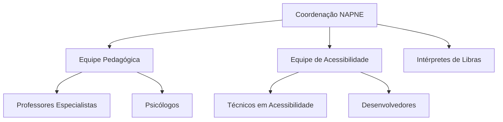

# Equipe

## Coordenação

A equipe do NAPNE é composta por profissionais multidisciplinares comprometidos com a inclusão educacional.

### Estrutura Organizacional



## Membros

### Coordenação Geral
- **Nome:** A definir
- **Cargo:** Coordenador(a) do NAPNE
- **Formação:** A definir

### Equipe Técnica
- **Intérpretes de Libras**
- **Psicólogos Educacionais**
- **Pedagogos Especialistas**
- **Técnicos em Informática**

## Contato da Equipe

Para entrar em contato com membros específicos da equipe, utilize os canais oficiais de comunicação do NAPNE.

```{tip}
Nossa equipe está sempre disponível para atender às necessidades da comunidade acadêmica.
```